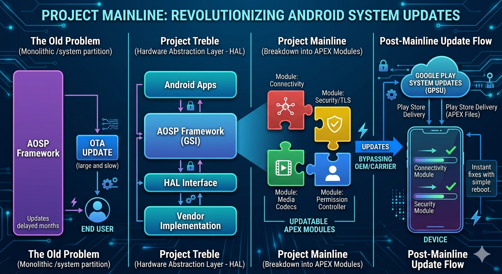

Even after Project Treble, updating a single core software library required building a massive system update that cellular carriers delayed for months with testing. Project Mainline fixed this by shattering the Android framework into separate, swappable bricks. It uses a new file format called APEX. Unlike regular apps, APEX files contain raw filesystem images. A low-level daemon (apexd) mounts these images early in the boot sequence into a special /apex folder. This allows Google to patch critical system bugs directly through the Google Play Store, completely bypassing carrier delays with a simple phone reboot.

