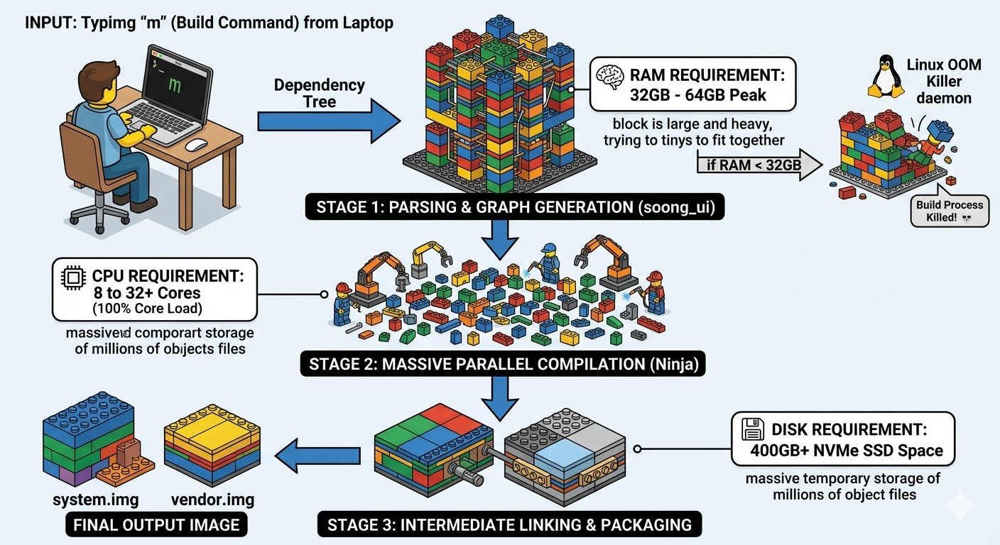

# Chapter 6: AOSP Host Compilation Requirements & Cloud Provisioning

## 1. Hardware Infrastructure Bottlenecks
Compiling the Android Open Source Project (AOSP) involves building over 100 Million lines of code across ~1,000 Git repositories. This creates extreme hardware constraints:

* **RAM (Memory Bounds):** Minimum **64 GB**. The initial build graphing phase (`soong_ui`) generates a massive multi-gigabyte dependency map. Dropping below 32GB triggers the Linux **Out-Of-Memory (OOM) Killer**, forcefully crashing the build.
* **CPU (Parallel Scale):** Minimum **8 Cores (16 Threads)**; Recommended **16 to 32+ Cores**. The underlying `Ninja` build execution tool parallelizes compilation tasks natively via `m -jN`.
* **Storage (I/O Operations):** Minimum **400 GB free space** on a high-speed **NVMe SSD**. Traditional spinning Hard Drives (HDDs) fail due to physical latency bottlenecks when processing millions of tiny C/C++ object files (`.o`).

## 2. Host Operating System Restrictions
Native compilation on standalone macOS or Windows environments fails due to core OS architectural designs:
* **Case Sensitivity:** AOSP utilizes unique files with identical names differing only by case (e.g., `File.cpp` vs `file.cpp`). Case-insensitive file systems (default Windows/macOS) overwrite and corrupt the source tree.
* **Path Length Limits:** Windows enforces a strict 260-character maximum (`MAX_PATH`). AOSP’s nested directory trees routinely exceed 400 characters.

## 3. Recommended Cloud Architecture Workstation (For Mac Users)
* **Cloud Instance:** Google Cloud Platform (GCP) Compute Engine.
* **Machine Type:** `c2-standard-16` or `e2-standard-16` (16 vCPUs, 64 GB RAM).
* **Boot Disk Configuration:** 500 GB Ubuntu 22.04 LTS (SSD Persistent Disk).
* **Workflow:** Local Mac runs as an interactive interface thin-client via **Secure Shell (SSH)** or **VS Code Remote-SSH**, offloading 100% of compute and disk requirements to the virtualized Linux cloud backend.

